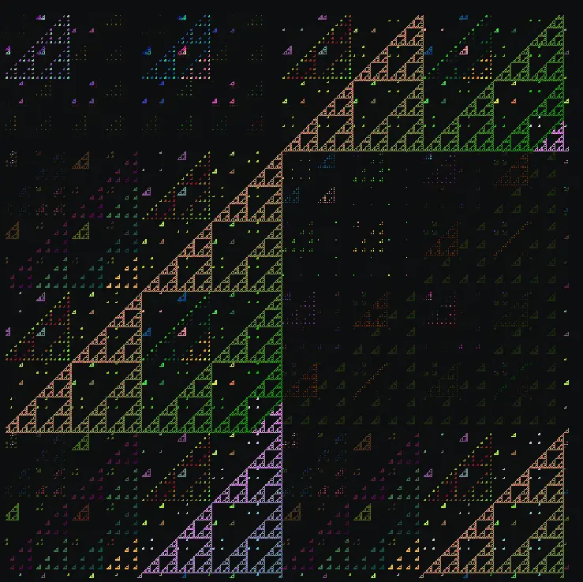

# world-of-wasm

`world-of-wasm` is a tiny graphics project written in Rust.  It's a
procedurally generated world of triangles embodied inside triangles with
pseudo-random colors from the rainbow resulting in one big cohesive pattern.
